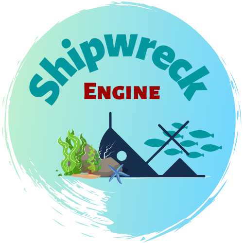

<p align="center">
    
</p>

# ShipWreck engine (linux) ⚓
###### Project Template for linux

## Description :open_book:

This a template to make your project with ShipWreck Engine on linux platform. \
This repository contains all you need and doesn't contain any example.

## Installation :gear:
* Clone the repo
* Open the project with your IDE
* All done! :boat: 

## Quick Start :runner:
* Open the project
* Make your game
* Run the `cmake.sh` to build the project
```shell
./cmake.sh [PATH] [FOLDER] [OPTION]
```
* PATH - path to the cmake
* FOLDER - folder where the project will be built
* OPTION - **re** or **fclean** or **clean**

## Author

Made with :heart: \
Creative Rift's team ⚓
